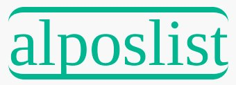

<!-- PROJECT LOGO -->
 

  
 

  <h3 align="center">Online marketplace - aka alposlist</h3>

  

    A web application built with Flask, HTML and PostgreSQL. It takes inspiration from online marketplaces such as tori.fi and Craig's list
     
    <a href="https://github.com/alpo-p/marketplace"><strong>Explore the docs »</strong></a>
     
     
    <a href="https://alposlist.herokuapp.com/">View Demo</a>
     
    <b>Demo-account:</b> demo
     
    <b>Demo-password:</b> password
  

<!-- TABLE OF CONTENTS -->

  
<h2 style="display: inline-block">Table of Contents</h2>

  <ol>
    <li>
      <a href="#about-the-project">About The Project</a>
      <ul>
        <li><a href="#built-with">Built With</a></li>
      </ul>
    </li>
    <li>
      <a href="#getting-started">Getting Started</a>
    </li>
    <li><a href="#license">License</a></li>
    <li><a href="#contact">Contact</a></li>
    <li><a href="#acknowledgements">Acknowledgements</a></li>
  </ol>

<!-- ABOUT THE PROJECT -->
## About The Project
This is a web application intended to mimic craigslist or other similar online marketplaces. Note: the page is completely in Finnish!
  
<strong>Features</strong>
* Secure logging-in/out and registering a new user
* Mobile responsive with fast loadtimes
* Front-page with search-bar and 3 newest sales ads
* Ability to add new sales ads
* Viewing sales ads by categories (limited to 5 per page)
* Viewing a single sales ad
* Searching the titles of sales ads and showing a search results page
* A very light admin-panel
* Security: shielded against CSRF attacks and SQL-injections

<a href="alposlist.herokuapp.com">SEE THE SITE HERE</a>

[![Marketplace Screen Shot][product-screenshot]]

### Built With

<strong>Front-end:</strong>
* HTML5
* Jinja2
* Javascript
* CSS
* Bootstrap3
* jQuery
* FontAwesome (icons)

<strong>Back-end:</strong>
* Flask
* Python
* SQLAlchemy
* Werkzeug Security

<strong>Data:</strong>
* PostgreSQL
* AWS S3 Buckets  

<!-- GETTING STARTED -->
## Getting Started

Clone this repository and install the dependencies in requirements.txt. 
Start the web application by running flask with command <code>flask run</code>.

<!-- LICENSE -->
## License

Distributed under the MIT License. See `LICENSE` for more information.

<!-- CONTACT -->
## Contact

Project Link: [https://github.com/alpo-p/marketplace](https://github.com/alpo-p/marketplace)

<!-- ACKNOWLEDGEMENTS -->
## Acknowledgements

* Made as a part of the studies in the University of Helsinki. Big thanks to the good materials provided by A. Laaksonen et al.
* Also thanks to all open source tech used in the project 

<!-- MARKDOWN LINKS & IMAGES -->
[contributors-shield]: https://img.shields.io/github/contributors/alpo-p/marketplace.svg?style=for-the-badge
[contributors-url]: https://github.com/alpo-p/marketplace/graphs/contributors
[forks-shield]: https://img.shields.io/github/forks/alpo-p/marketplace.svg?style=for-the-badge
[forks-url]: https://github.com/alpo-p/marketplace/network/members
[stars-shield]: https://img.shields.io/github/stars/alpo-p/marketplace.svg?style=for-the-badge
[stars-url]: https://github.com/alpo-p/marketplace/stargazers
[issues-shield]: https://img.shields.io/github/issues/alpo-p/marketplace.svg?style=for-the-badge
[issues-url]: https://github.com/alpo-p/marketplace/issues
[license-shield]: https://img.shields.io/github/license/alpo-p/marketplace.svg?style=for-the-badge
[license-url]: https://github.com/alpo-p/marketplace/blob/master/LICENSE.txt
[linkedin-shield]: https://img.shields.io/badge/-LinkedIn-black.svg?style=for-the-badge&logo=linkedin&colorB=555
[linkedin-url]: https://linkedin.com/in/alpopanula
[product-screenshot]: screenshot-mobile.jpg

